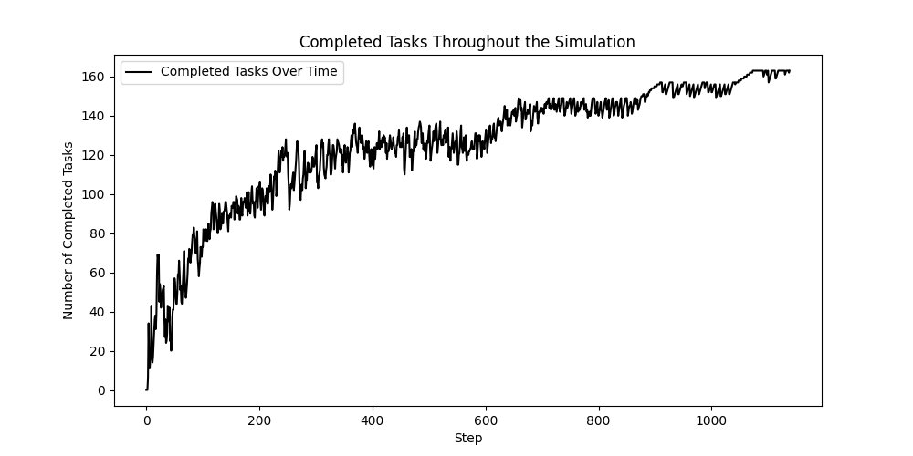
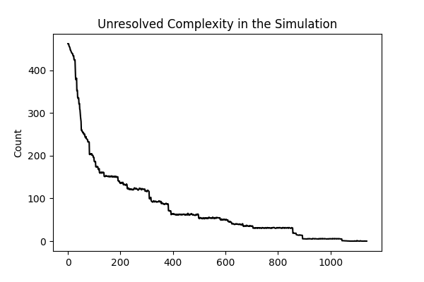
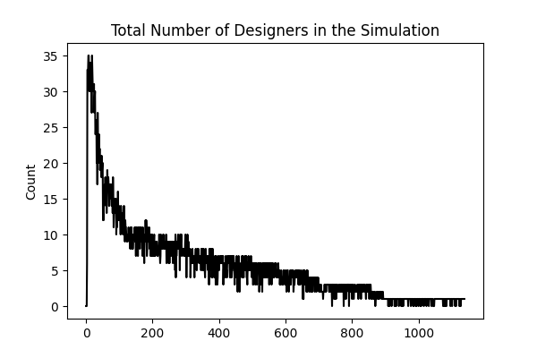

# TaekniogVoruthroun

## Description
This repository contains the implementation of a simulation model in Python, based on the research conducted by [Zhang et al.][Zhang]. Their project was built using the simulation software Anylogic, further information on Anylogic can be found [here](https://www.anylogic.com) . The project aims to replicate the findings and provide a tool for further exploration of the concepts of knowledge within development processes. This paper is about how learning can improve product development processes and how knowledge can help in product design.

## Motivation
The motivation behind this project is to deepen the understanding of the simulation techniques discussed by [Zhang et al.][Zhang], and to provide a practical application of these methods in Python. The model in this simulation is agent-based so this will give the students deeper understanding about agent-based simulations. This paper was found by the teacher of this course and encouraged the students to face this challenge.

## Installation
To set up this project locally, follow the steps below:

0. Installing python on your machine, if you do not already have python on your machine you will have to install it [here](https://www.python.org/downloads/)

1. Clone the repository:
Enter the following commands in a Terminal window in a folder where you intend to keep the files.
```
git clone https://github.com/yourusername/TaekniogVoruthroun.git
```
2. Navigate to the project directory:

``` 
cd TaekniogVoruthroun
```
3. Install the required packages, this will ensure that the correct Mesa package will be installed [^1] :

```
pip install -r requirements.txt
```
## Usage
To run the simulation model, execute the following command:

```
python3 main.py
```

## Findings of the simulations

This picture was taken from the result of the article [Zhang et al.][Zhang]. The pictures show the changes of the baseline scenario with time. Figure A show rate of finished task and the figure show that the finished task rate follows exponential distribution. Figure B shows the changes of the complexity. Figure C shows the number of active designers.


## Findings of our simulation

The following figures are the results of the simuation model built with Python's Mesa package. They are a fairly good representation of the original but there is still work left, mainly finetuning of parameters that was not specified in the article by [Zhang et al.][Zhang]. This can be observed in the B figures of both simulations where the shape of the line is obviously not the same. 

<p float="left">
  
   
  
</p>


## Discussions 
The article by [Zhang et al.][Zhang] is well written and has good representations of the model that they built and the tests that they performed but it could use a better explanation of its elements. Although the Mesa built model is not perfect it comes quite close in replicating the results of the original article, as can be seen if figures A and C are compared in both models.

This was a great opportunity to get acquainted with the Mesa simulation package for python while trying to reconstruct a prebuilt model from other fellow scholars using another software. Having the chance to implement the model and try to verify the results that the original paper set forth. This is of course the foundation of peer-reviewing for fellow academics.

## Acknowledgments
- Zhang and Thomson for their foundational paper [Zhang et al.][Zhang]
- Special thanks to our teacher for his guidance and feedback
- A huge thank you to our fellow student for their time and help with technical problems

[Zhang]: https://link.springer.com/article/10.1007/s00163-017-0274-3
[^1]: There where scheduled changes to the Mesa package sometime around 2025
