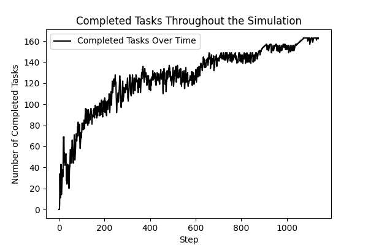

# TaekniogVoruthroun

## Description
This repository contains the implementation of a simulation model in Python, based on the research conducted by Zhang and Thomson. The project aims to replicate the findings and provide a tool for further exploration of the concepts discussed in the paper. This paper is about how learning can improve product development processes and how knowledge can help in product design.

## Motivation
The motivation behind this project is to deepen the understanding of the simulation techniques discussed by Zhang and Thomson, and to provide a practical application of these methods in Python. The model in this simulation is agent-based so this will give the students deeper understanding about agent-based simulations. This paper was found by the teacher of this course and encouraged the students to face this challenge.

## Installation
To set up this project locally, follow the steps below:

0. Installing python on your machine, if you do not already have python on your machine you will have to install it [here]{https://www.python.org/downloads/}

1. Clone the repository:
Enter the following commands in a Terminal window in a folder where you intend to keep the files.
```
git clone https://github.com/yourusername/TaekniogVoruthroun.git
```
2. Navigate to the project directory:

``` 
cd TaekniogVoruthroun
```
3. Install the required packages:

```
pip install -r requirements.txt
```
## Usage
To run the simulation model, execute the following command:

```
python3 main.py
```

## Findings of the simulations

This picture was taken from the result of the article Zang and Thomas. The pictures show the changes of the baseline scenario with time. Graph a show rate of finished task and the graph show that the finished task rate follows exponential distribution. Graph b shows the changes of the complexity. Graph c shows the number of active designers.


## Findings of our simulation

The following images are the results of the simuation model built with Python's Mesa package.

<p float="left">
  
   
  
</p>


## Acknowledgments
- Zhang and Thomson for their foundational paper
- Special thanks to our teacher for his guidance and feedback
- A huge thank you to our fellow student for their time and help with technical problems

